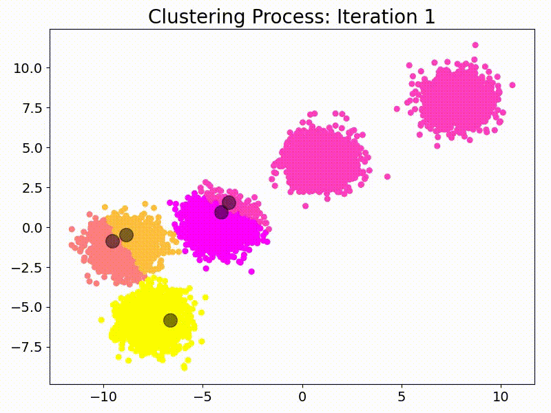

# K-Means Algorithm Repository

   <!-- You can adjust the width value as needed -->

## Introduction

Welcome to my repository dedicated to the K-Means clustering algorithm. This space is a synthesis of rigorous academic understanding and hands-on Python demonstrations, aimed at providing a comprehensive perspective on this foundational data science technique.

## Repository Contents

1. [K-Means Detailed Analysis](./Implementation/Overview.md): A structured exposition of the K-Means algorithm, designed for clarity and depth.
2. [Python Codebase](./Implementation/Code/): Within this section, you'll encounter Python scripts I've developed to elucidate the K-Means algorithm's practical aspects. Each piece of code is methodically organized and annotated for enhanced comprehension.
3. [Visual Gallery](./Images/): A curated set of visual aids, including plots and animations, to provide a graphical representation of the algorithm's dynamics.

## Python Implementation

In crafting the codebase, precision and clarity were paramount:

- **Data Synthesis**: [data-generation.py](./Implementation/Code/data-generation.py)
- **Utility Functions**: [helper-functions.py](./Implementation/Code/helper-functions.py)
- **K-Means Core Logic**: [k-means-implementation.py](./Implementation/Code/k-means-implementation.py)
- **Visualization Tools**: [plotting-results.py](./Implementation/Code/plotting-results.py)

## About My Blog

For those interested in delving deeper into data science topics, I invite you to visit my blog, [Data Science Lifelong Learn](https://datasciencelifelonglearn.blogspot.com/). It serves as a platform where I share intricate algorithms, detailed explanations, and my personal insights into the ever-evolving world of data science.

## Licensing

This project adheres to the [MIT](./LICENSE) licensing framework. I encourage exploration, adaptation, and sharing.

